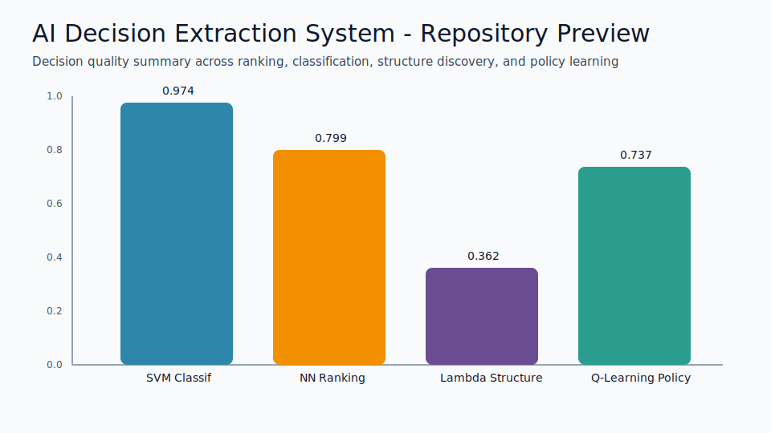

# AI Decision Extraction System

Graduate-level Advanced Algorithms for Data Science project focused on converting model outputs into usable human decisions.

## Project Goal
This repository is designed as an AI decision-support workflow, not only a model training exercise. It transforms raw outputs from K-means, Lambda-connectedness, SVM, Neural Networks, and Q-learning into:
- ranked lists
- top-k selections
- grouped segments
- risk categories
- policy decisions

## Main Notebook
- `notebooks/Advanced_DS_Final_Project_New.ipynb`

## Repository Preview



## Repository Structure
- `notebooks/` Jupyter notebooks
- `data/` optional local datasets or exports (kept empty by default)
- `artifacts/` generated figures/tables if exported
- `requirements.txt` Python dependencies
- `.gitignore` files and folders excluded from git

## Datasets Used
1. California Housing (American Housing)
2. Breast Cancer Wisconsin
3. MNIST
4. FrozenLake (Gymnasium)

## Decision Outputs Included
- Top cheapest and most expensive cities (unique city rankings)
- Highest-risk and lowest-risk patient profiles
- Most confident and least confident digit decisions
- Optimal reinforcement policy by named environment tile

## Quick Start
1. Create and activate a virtual environment.
2. Install dependencies:
   ```bash
   pip install -r requirements.txt
   ```
3. Open and run the notebook:
   - `notebooks/Advanced_DS_Final_Project_New.ipynb`

## Notes
- Some datasets are downloaded automatically through scikit-learn/OpenML.
- Housing city labels are generated using nearest major-city mapping from latitude/longitude.
- Project outputs are intended for interpretability and decision support.

## License

This project is released under the MIT License. See `LICENSE`.
